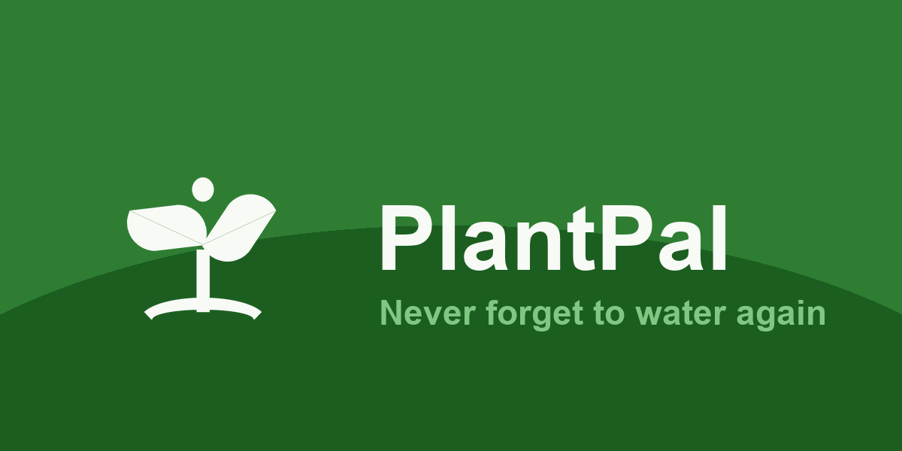
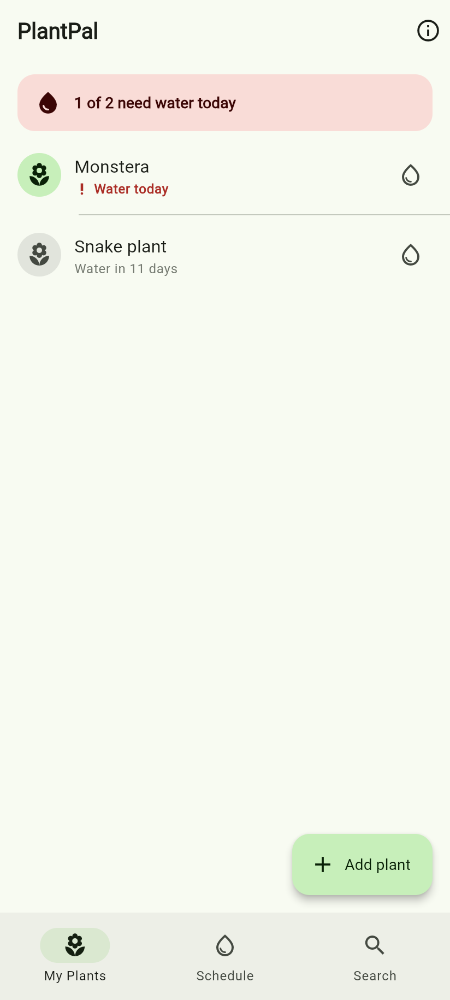
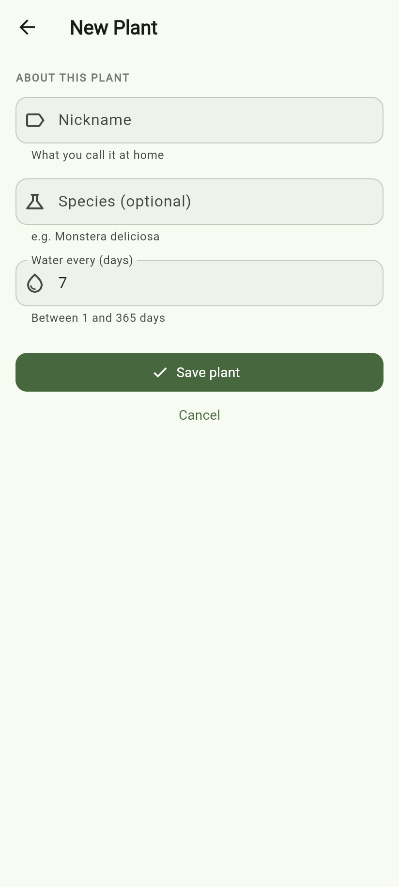
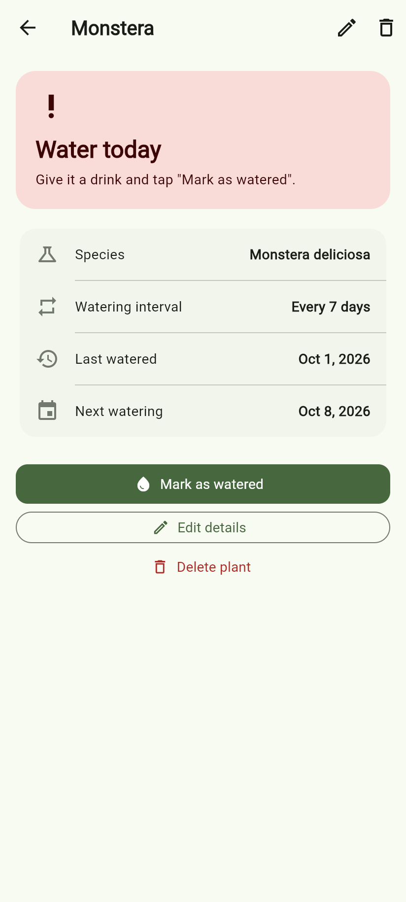
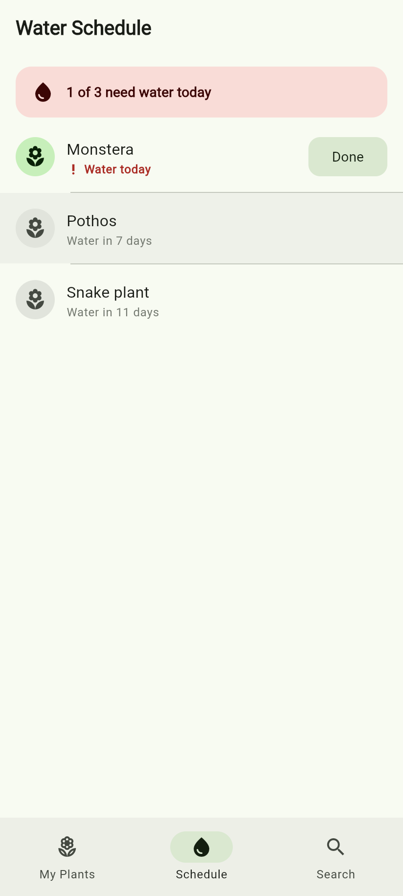
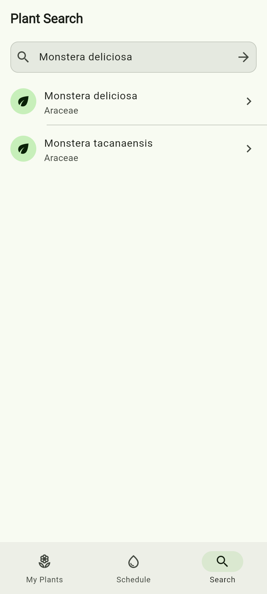
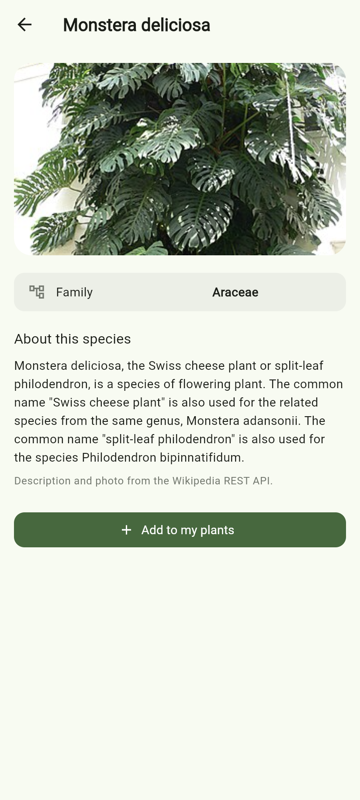
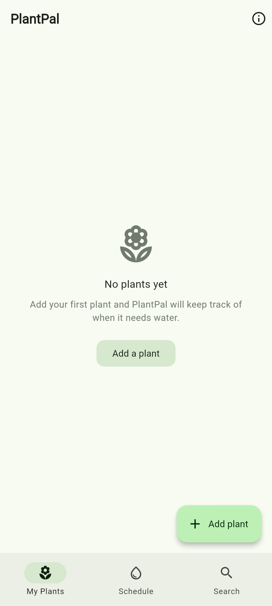
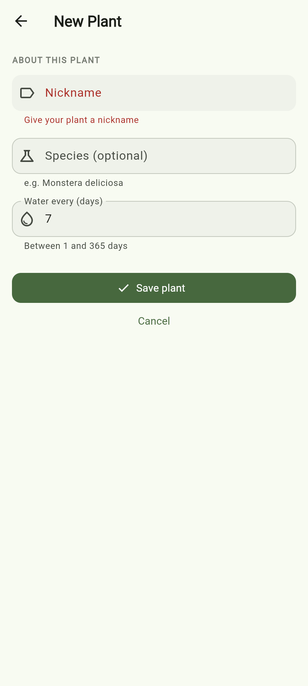
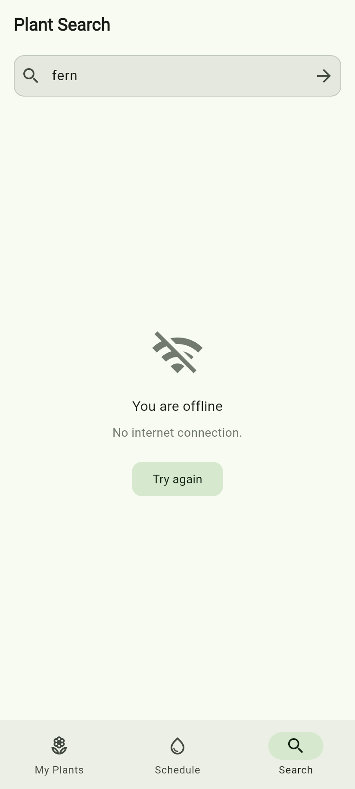

# PlantPal

**A houseplant care tracker built with Flutter.**



PlantPal helps you stop killing your houseplants. Log each plant you own, tell
the app how often it needs water, and PlantPal keeps track of what is due —
then lets you look up any species in a real botanical database to see a photo
and care notes.

Built for **SE2142 — Software Engineering Tools and Practices**, Final Project.

| | |
|---|---|
| **App name** | PlantPal |
| **Group** | FP-RootAccess |
| **Platform** | Android (Flutter / Dart) |
| **Repository** | https://github.com/dslvd/FP-RootAccess |
| **Version** | 1.0.0 (build 1) |

---

## Table of contents

- [What it does](#what-it-does)
- [Screenshots](#screenshots)
- [Features](#features)
- [Tech stack and packages](#tech-stack-and-packages)
- [Project structure](#project-structure)
- [Setup and run](#setup-and-run)
- [Building a release APK](#building-a-release-apk)
- [Running the tests](#running-the-tests)
- [Debugging case study](#debugging-case-study)
- [APIs used](#apis-used)
- [Team members and roles](#team-members-and-roles)
- [References](#references)

---

## What it does

Most houseplants die from watering mistakes rather than neglect — either too
much or too little. The problem is not that people forget, it is that they
lose track: each plant has its own rhythm, and a plastic tag from the nursery
is easy to lose.

PlantPal keeps one list of your plants. Each entry stores a nickname, the
species, how many days between waterings, and the last date you watered it.
From that, the app works out which plants are due today, which are overdue, and
which are fine — and shows the whole schedule in order. A second feature
connects to the GBIF botanical database so you can search any species and see
its photo and description.

---

## Screenshots

| Screen | What it shows |
|---|---|
|  | **My Plants** — the home tab, with a summary banner and a water-now button on each row |
|  | **Add / Edit Plant** — the form, with validation on the nickname and interval |
|  | **Plant Details** — status card plus edit and delete actions |
|  | **Water Schedule** — the same plants ordered by next watering date |
|  | **Plant Search** — live results from the GBIF species API |
|  | **Species Details** — the Wikipedia photo and description |
|  | **Empty state** — what a new install with no plants looks like |
|  | **Form validation** — the Add Plant form rejecting bad input |
|  | **Offline handling** — a failed API call with a retry |

---

## Features

### Core

- **My Plants (home tab)** — lists every plant with its watering status
  ("Water today", "Overdue by 2 days", "Water in 3 days"), plus a summary
  banner telling you how many need water. Tap a row for details, tap the water
  drop to mark it watered, tap **+** to add a plant.
- **Add / Edit Plant** — one form used for both creating and editing. Validates
  that the nickname is present and under 40 characters, and that the watering
  interval is a whole number between 1 and 365.
- **Plant Details** — a status card, species, interval, last watered and next
  watering dates, with **Mark as watered**, **Edit details** and
  **Delete plant** (behind a confirmation dialog).
- **Water Schedule** — the same plants re-ordered so the most urgent come first,
  with a one-tap **Done** button on anything due today.
- **Plant Search** — searches the GBIF species database by name, collapsing
  duplicate results, and shows each species' scientific name and family.
- **Species Details** — the species photo and description pulled from
  Wikipedia, with an **Add to my plants** button.
- **Persistence** — the plant list is written to device storage, so it is still
  there after the app is closed.

### Error and edge-case handling

- **Empty states** — distinct, friendly messages for "no plants yet", "nothing
  scheduled" and "no search results", each with a relevant action.
- **No internet** — a failed request is classified as *offline* versus *server
  error*, and shows the right icon, message and a **Try again** button.
- **Failed image loads** — a broken Wikipedia image URL falls back to a
  placeholder instead of a red error box.
- **Corrupt saved data** — if the stored JSON cannot be parsed the app logs the
  problem and starts from a seed list rather than crashing.
- **Form validation** — inline field errors, not silent failures.
- **Undo** — marking a plant watered shows a snack bar with an **Undo** action.

---

## Tech stack and packages

| Package | Version | Why it is used |
|---|---|---|
| [`provider`](https://pub.dev/packages/provider) | ^6.1.5 | `ChangeNotifier`-based shared state. The plant list is read by four screens, so it lives in one `PlantProvider` instead of being threaded through constructors. |
| [`http`](https://pub.dev/packages/http) | ^1.6.0 | REST calls to the GBIF and Wikipedia APIs. |
| [`shared_preferences`](https://pub.dev/packages/shared_preferences) | ^2.5.5 | Stores the plant list as JSON on the device. |
| [`cupertino_icons`](https://pub.dev/packages/cupertino_icons) | ^1.0.8 | iOS-style icon font. |
| [`flutter_lints`](https://pub.dev/packages/flutter_lints) | ^6.0.0 | The lint rule set used by `flutter analyze`. |
| [`flutter_launcher_icons`](https://pub.dev/packages/flutter_launcher_icons) | ^0.14.4 | Generates the Android launcher icon at every density. |
| [`flutter_native_splash`](https://pub.dev/packages/flutter_native_splash) | ^2.4.7 | Generates the native splash screen. |

No API keys are required — both APIs used are public.

---

## Project structure

The app follows a layered structure so UI code never talks to the network or
to storage directly.

```
lib/
├── main.dart                     # entry point: loads saved plants, then runApp
├── app.dart                      # MaterialApp, theme, and the Provider setup
├── routes.dart                   # named-route constants and the route table
├── theme.dart                    # one place for colours, text and component styling
│
├── models/                       # plain data classes, no Flutter imports
│   ├── plant.dart                # the Plant entity + JSON (de)serialisation
│   └── species.dart              # Species / SpeciesInfo from the two APIs
│
├── providers/                    # shared state
│   └── plant_provider.dart       # ChangeNotifier: CRUD + persistence + derived lists
│
├── services/                     # the outside world
│   └── plant_api.dart            # GBIF + Wikipedia calls, error classification
│
├── screens/                      # one file per screen
│   ├── home_shell.dart           # bottom navigation host
│   ├── plant_list_screen.dart    # My Plants (tab 1)
│   ├── schedule_screen.dart      # Water Schedule (tab 2)
│   ├── search_screen.dart        # Plant Search (tab 3)
│   ├── add_plant_screen.dart     # Add / Edit Plant
│   ├── plant_detail_screen.dart  # Plant Details
│   └── species_detail_screen.dart# Species Details
│
└── widgets/                      # custom widgets reused across screens
    ├── plant_list_tile.dart      # the plant row (My Plants + Water Schedule)
    ├── empty_state.dart          # the empty placeholder (3 screens)
    ├── watering_summary_banner.dart # the "N need water today" banner (2 screens)
    └── async_builder.dart        # loading / error / success wrapper for API screens
```

### Reusable widgets

Four custom widgets are used on more than one screen, which is what keeps the
screens short:

| Widget | Used by |
|---|---|
| `PlantListTile` | My Plants, Water Schedule |
| `WateringSummaryBanner` | My Plants, Water Schedule |
| `EmptyState` | My Plants, Water Schedule, Plant Search |
| `AsyncBuilder` | Species Details (and available to any API-backed screen) |

---

## Setup and run

### Requirements

- Flutter 3.38+ (`flutter --version`)
- Dart 3.10+
- Android SDK with an emulator or a physical device
- JDK 17 (Gradle does not yet support JDK 21+)

### Steps

```bash
# 1. Get the code
git clone https://github.com/dslvd/FP-RootAccess.git
cd FP-RootAccess

# 2. Install packages
flutter pub get

# 3. Confirm the toolchain is happy
flutter doctor

# 4. Run on a connected device or emulator
flutter run
```

To run with a specific device:

```bash
flutter devices          # list what is available
flutter run -d emulator-5554
```

---

## Building a release APK

```bash
flutter clean
flutter pub get
flutter build apk --release
```

The APK is written to:

```
build/app/outputs/flutter-apk/app-release.apk
```

**Debug vs release:** `flutter run` builds a *debug* APK — larger, slower, and
it includes the Dart VM and hot-reload support. `flutter build apk --release`
builds the *release* APK, which is AOT-compiled to native ARM code, has the
debugging hooks stripped out, and is what gets submitted. The release build is
roughly a third of the size.

To regenerate the launcher icon and splash screen after changing the artwork:

```bash
dart run flutter_launcher_icons
dart run flutter_native_splash:create
```

---

## Running the tests

```bash
flutter test              # all 25 tests
flutter analyze           # static analysis, must be clean
dart format --output=none --set-exit-if-changed lib test
```

The suite covers:

- **`test/plant_api_test.dart`** — JSON parsing for both APIs, duplicate
  collapsing, the `canonicalName` → `scientificName` fallback, a 404 being
  treated as "no info" rather than an error, and offline vs. server-error
  classification.
- **`test/plant_provider_test.dart`** — every CRUD operation, the derived
  `byNextWatering` and `dueToday` lists, listener notification, JSON round-trip,
  tolerance of missing fields, and recovery from a corrupt stored payload.
- **`test/widget_test.dart`** — the app launches with a plant list, the empty
  state appears when there are none, the summary banner counts correctly, tapping
  a plant opens its details, watering updates the UI, the bottom navigation
  switches tabs, and the add form rejects an empty nickname.

---

## Debugging case study

**The bug:** every plant row on the home screen failed to lay out. The list
rendered as a broken grey area and the console filled with repeated errors:

```
The following assertion was thrown during performLayout():
Trailing widget consumes the entire tile width (including ListTile.contentPadding).
Either resize the tile width so that the trailing widget plus any content padding
do not exceed the tile width, or use a sized widget, or consider replacing
ListTile with a custom widget.

The following _TypeError was thrown during performLayout():
Null check operator used on a null value
```

**How it was found:** the widget tests went red while I was wiring up the new
`PlantListTile`. Flutter's test runner prints the *first* exception in the
chain, so instead of reading the loud `Null check operator used on a null
value` at the bottom I read the assertion above it — the "trailing widget
consumes the entire tile width" message named the real cause. The `_TypeError`
was only a *downstream* symptom: because the tile never got a size, the sliver
that contained it later dereferenced a null geometry value. I confirmed the
ordering by capturing `FlutterError.onError` in a scratch test and printing the
exceptions in the order they fired.

**Root cause:** in `lib/theme.dart` I had set the global button style to

```dart
minimumSize: const Size.fromHeight(48),
```

`Size.fromHeight(48)` is shorthand for `Size(double.infinity, 48)` — an
**infinite minimum width**. Any `FilledButton` therefore demanded all the
horizontal space available. That is harmless for a button inside a `ListView`,
but the Water Schedule screen used a `FilledButton.tonal` as the `trailing`
widget of a `ListTile`, and a trailing widget is given a bounded width. The
button asked for infinite width, the tile had no room left for its title, and
the layout assertion fired.

**The fix** (`lib/theme.dart`):

```dart
// NOTE: deliberately NOT Size.fromHeight(48). That helper expands to
// Size(double.infinity, 48), and an infinite minimum width makes any
// FilledButton used as a ListTile.trailing widget swallow the entire row.
minimumSize: const Size(64, 48),
```

A finite minimum keeps buttons a consistent 48 logical pixels tall while
letting them size to their content. Full-width buttons are unaffected, because
a `ListView` already gives its children a tight cross-axis constraint — so the
form's "Save plant" button still stretches edge to edge.

**What I would take from this:** the loudest error in a Flutter stack trace is
often the last one to be thrown, not the cause. Reading the *first* exception
in the chain, and taking "RenderBox was not laid out" as a symptom rather than
the problem, is what actually located this bug.

---

## APIs used

Both are public and require no API key.

### 1. GBIF Species API — species search

```
GET https://api.gbif.org/v1/species/search
      ?q={name}&rank=SPECIES&status=ACCEPTED&highertaxonKey=6&limit=20
```

`highertaxonKey=6` restricts results to the plant kingdom. A trimmed sample
response:

```json
{
  "offset": 0,
  "limit": 2,
  "count": 92,
  "results": [
    {
      "key": 2868214,
      "family": "Araceae",
      "genus": "Monstera",
      "species": "Monstera acuminata",
      "scientificName": "Monstera acuminata K.Koch",
      "canonicalName": "Monstera acuminata",
      "rank": "SPECIES",
      "taxonomicStatus": "ACCEPTED"
    }
  ]
}
```

Docs: <https://techdocs.gbif.org/en/openapi/v1/species>

### 2. Wikipedia REST API — photo and description

```
GET https://en.wikipedia.org/api/rest_v1/page/summary/{Scientific_name}
```

A trimmed sample response:

```json
{
  "title": "Monstera deliciosa",
  "description": "Species of plant",
  "extract": "Monstera deliciosa, the Swiss cheese plant or split-leaf philodendron, is a species of flowering plant.",
  "thumbnail": {
    "source": "https://thumb.wikimedia.org/.../330px-Monstera_deliciosa2.jpg",
    "width": 330,
    "height": 375
  }
}
```

Docs: <https://en.wikipedia.org/api/rest_v1/>

### Model classes

| API | JSON key | Dart field | Dart type |
|---|---|---|---|
| GBIF | `key` | `key` | `int` |
| GBIF | `canonicalName` (falls back to `scientificName`) | `scientificName` | `String` |
| GBIF | `family` | `family` | `String?` |
| Wikipedia | `extract` | `description` | `String?` |
| Wikipedia | `thumbnail.source` | `imageUrl` | `String?` |

---

## Team members and roles

| Member | GitHub | Responsibilities |
|---|---|---|
| Matthew J. Estilo | [@dslvd](https://github.com/dslvd) | All roles (individual project): UI and widgets, state management, API and data layer, Git/repository management, testing and QA, documentation |

> **Note on scope:** this was submitted as an individual project, so every role
> above was carried by one member. The repository therefore shows a single
> contributor's commit history rather than a split between teammates.

---

## References

- Flutter documentation — <https://docs.flutter.dev>
- `provider` package documentation — <https://pub.dev/packages/provider>
- `http` package documentation — <https://pub.dev/packages/http>
- `shared_preferences` package documentation — <https://pub.dev/packages/shared_preferences>
- GBIF Species API technical documentation — <https://techdocs.gbif.org/en/openapi/v1/species>
- Wikipedia REST API documentation — <https://en.wikipedia.org/api/rest_v1/>
- `flutter_launcher_icons` — <https://pub.dev/packages/flutter_launcher_icons>
- `flutter_native_splash` — <https://pub.dev/packages/flutter_native_splash>
- Material 3 design guidance — <https://m3.material.io>
- Icon and splash artwork: original, generated for this project (see `assets/`).

---

## License

Coursework submitted for SE2142. Not licensed for redistribution.
